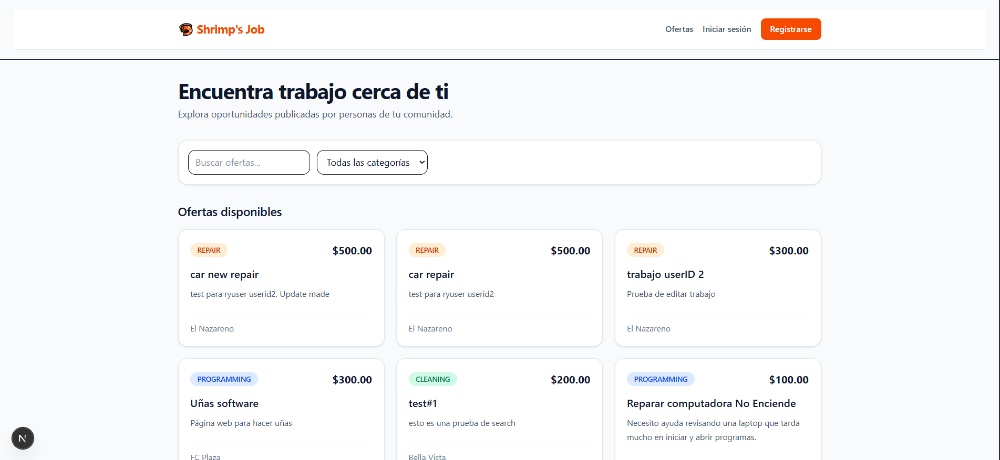
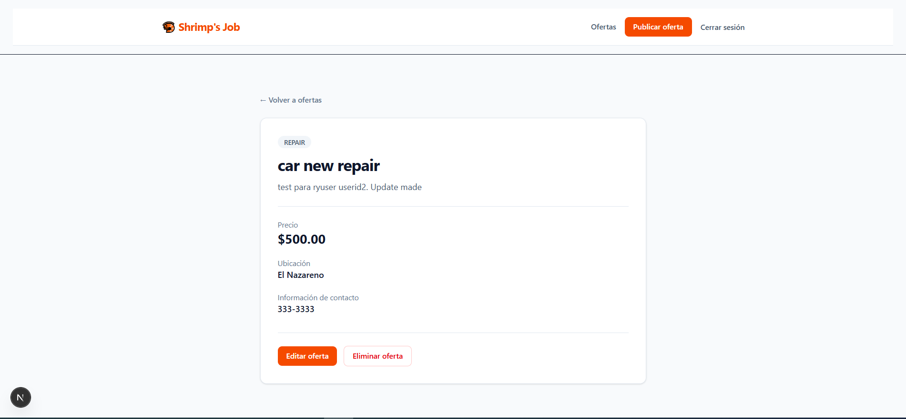
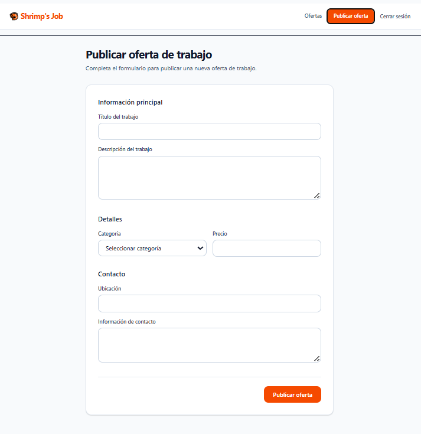
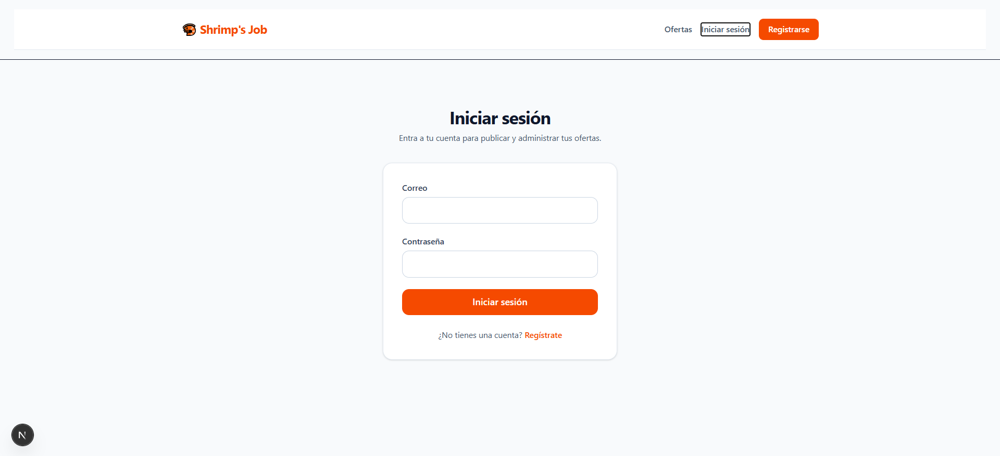

# 🦐 Shrimp's Job

**Shrimp's Job** es una aplicación web comunitaria para publicar y encontrar trabajos y servicios locales.

El proyecto permite que los usuarios creen una cuenta, publiquen ofertas de trabajo, exploren oportunidades disponibles y administren únicamente las publicaciones que les pertenecen.

Fue desarrollado como un proyecto Full Stack utilizando Next.js, TypeScript, Prisma y SQLite.

---

## 📸 Capturas

### Dashboard



### Detalle de una oferta



### Publicar una oferta



### Inicio de sesión



---

## ✨ Funcionalidades

- Registro de usuarios.
- Inicio y cierre de sesión.
- Autenticación mediante JWT.
- Contraseñas almacenadas mediante hashing.
- Sesiones mediante cookies `httpOnly`.
- Publicación de ofertas de trabajo.
- Visualización de ofertas disponibles.
- Vista detallada de cada oferta.
- Edición de ofertas propias.
- Eliminación de ofertas propias.
- Protección de operaciones según el propietario de la publicación.
- Búsqueda de ofertas.
- Filtrado por categoría.
- Interfaz responsive.

---

## 🛠️ Tecnologías

### Frontend

- Next.js 16
- React 19
- TypeScript
- Tailwind CSS

### Backend

- Next.js Server Actions
- Prisma ORM
- SQLite

### Autenticación

- JSON Web Tokens (JWT)
- bcryptjs
- Cookies `httpOnly`

---

## 🏗️ Arquitectura

La aplicación utiliza **Next.js App Router** y Server Actions para manejar las operaciones realizadas desde la interfaz.

El flujo principal de las operaciones sigue aproximadamente esta estructura:

```text
UI
 ↓
Server Actions
 ↓
Data Access
 ↓
Prisma ORM
 ↓
SQLite
```

Las responsabilidades principales están separadas entre:

```text
app/
├── actions/          # Server Actions
├── dashboard/        # Dashboard y componentes de ofertas
├── job/              # Crear, visualizar y editar ofertas
├── login/            # Inicio de sesión
├── signup/           # Registro
└── ui/               # Componentes compartidos

lib/
├── auth.ts           # Autenticación y utilidades JWT
├── job-posts.ts      # Acceso a datos de ofertas
└── prisma.ts         # Cliente de Prisma

prisma/
└── schema.prisma     # Modelo de datos
```

---

## 🔐 Autenticación y autorización

Shrimp's Job implementa un sistema de autenticación propio basado en JWT.

Al iniciar sesión correctamente:

1. Las credenciales son verificadas.
2. Se genera un JWT asociado al usuario.
3. El token se almacena en una cookie `httpOnly`.
4. Las rutas y operaciones protegidas recuperan al usuario autenticado desde la sesión.

Las contraseñas no se almacenan directamente en la base de datos, sino como hashes generados con `bcryptjs`.

La aplicación también implementa autorización basada en propiedad.

Un usuario puede visualizar las ofertas de otros usuarios, pero únicamente puede **editar o eliminar sus propias publicaciones**.

---

## 🚀 Instalación

### 1. Clonar el repositorio

```bash
git clone <URL-DEL-REPOSITORIO>
cd shrimps-job
```

### 2. Instalar dependencias

```bash
npm install
```

### 3. Configurar variables de entorno

Crea un archivo `.env` en la raíz del proyecto:

```env
DATABASE_URL="file:./dev.db"
JWT_SECRET="tu_clave_secreta"
```

> No utilices esta clave de ejemplo en producción.

### 4. Preparar la base de datos

```bash
npx prisma migrate dev
```

### 5. Iniciar el servidor

```bash
npm run dev
```

Abre:

```text
http://localhost:3000
```

---

## 🗃️ Modelo de datos

El modelo principal de la aplicación está compuesto por usuarios y ofertas de trabajo.

Cada oferta pertenece a un usuario y contiene información como:

- Título
- Descripción
- Categoría
- Precio
- Ubicación
- Información de contacto
- Estado
- Fecha de creación y actualización

La relación entre usuario y publicación permite aplicar las reglas de autorización para edición y eliminación.

---

## 🧪 Calidad del código

La V1 fue verificada mediante:

```bash
npm run lint
npm run build
```

El proyecto compila correctamente para producción y pasa las comprobaciones de ESLint y TypeScript.

---

## 🗺️ Próximas mejoras

Algunas funcionalidades consideradas para versiones posteriores:

- Perfiles de usuario.
- Sistema para aceptar/tomar trabajos.
- Estados adicionales para las ofertas.
- Historial de trabajos.
- Mejoras en búsqueda y filtrado.
- Mejoras de experiencia de usuario.
- Despliegue público de la aplicación.

---

## 👨‍💻 Autor

**Jean Carlos Murgas**

Desarrollado como proyecto de portafolio Full Stack.